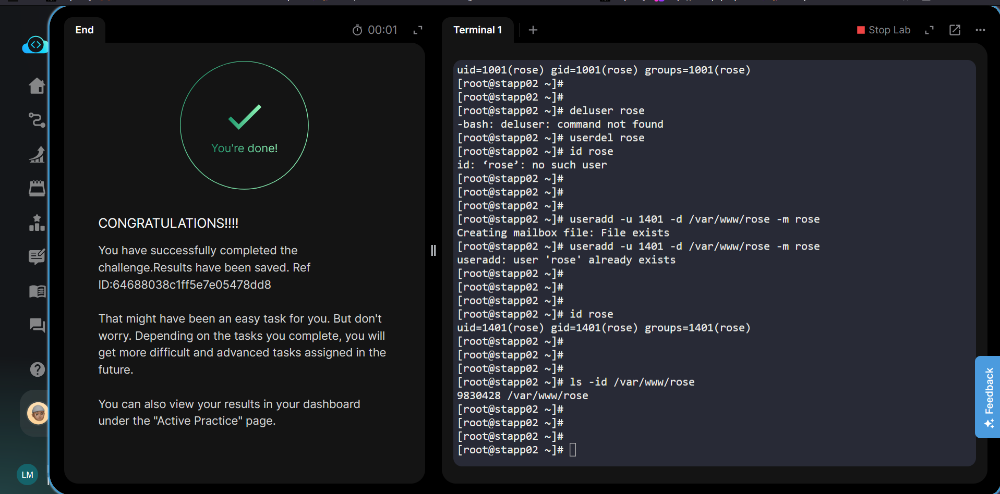

# Task 01 - Create a Custom Linux User

## 📖 Overview

This task demonstrates how to create a custom Linux user with a specific User ID (UID) and a custom home directory using the `useradd` command.

---

## 🎯 Learning Objectives

After completing this task, you will be able to:

- Understand what a Linux user is.
- Create a new user using `useradd`.
- Assign a custom UID.
- Specify a custom home directory.
- Verify that the user was created successfully.

---

## 📝 Task Summary

Create a user named `rose` with:

- Username: `rose`
- UID: `1401`
- Home Directory: `/var/www/rose`

---

## 🛠️ Prerequisites

- Linux system
- Root or sudo privileges
- Basic knowledge of the Linux terminal

---

## 💻 Solution

```bash
sudo useradd -u 1401 -d /var/www/rose -m rose
```

---

## 🔍 Command Breakdown

| Option | Description |
|---------|-------------|
| `sudo` | Run the command with administrator privileges. |
| `useradd` | Create a new Linux user. |
| `-u 1401` | Assign UID 1401. |
| `-d /var/www/rose` | Set the user's home directory. |
| `-m` | Create the home directory if it does not already exist. |
| `rose` | Username to create. |

---

## 📂 Files Updated

Creating a user updates several system files.

| File | Purpose |
|------|----------|
| `/etc/passwd` | User account information |
| `/etc/shadow` | Encrypted password information |
| `/etc/group` | Group information |
| `/etc/gshadow` | Secure group information |

---

## ✅ Verification

Check the user information:

```bash
id rose
```

Check the home directory:

```bash
ls -ld /var/www/rose
```

Check the passwd entry:

```bash
grep '^rose:' /etc/passwd
```

---

## 📷 Expected Output



```
images/output.png
```

---

## 🧠 Key Concepts Learned

- Linux identifies users using a UID.
- Home directories can be customized.
- `useradd` creates new user accounts.
- The `-m` option creates the user's home directory automatically.
- Root privileges are required to create users.

---

## ❓ Interview Questions

### What is a UID?

A UID (User ID) is a unique numeric identifier assigned to every Linux user.

---

### What is the purpose of the `-m` option?

It creates the user's home directory automatically.

---

### What happens if you omit the `-m` option?

The user account is created, but the home directory is not created automatically.

---

### Which file stores user account information?

`/etc/passwd`

---

## 📚 Related Commands

```bash
useradd
usermod
userdel
passwd
id
groups
whoami
getent
grep
ls
```

---

## 💡 Common Mistakes

- Forgetting to use `sudo`
- Using an existing UID
- Forgetting the `-m` option
- Typing the wrong home directory path

---

## 🎉 Conclusion

This task introduced the basics of Linux user management. Understanding how users, UIDs, and home directories work is essential for Linux system administration and DevOps.